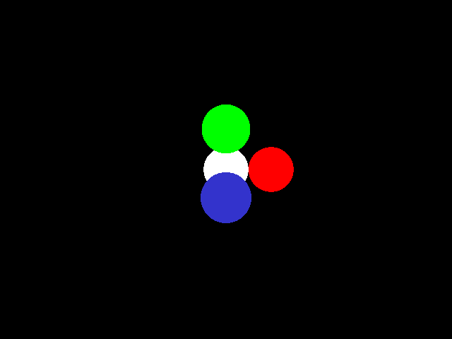
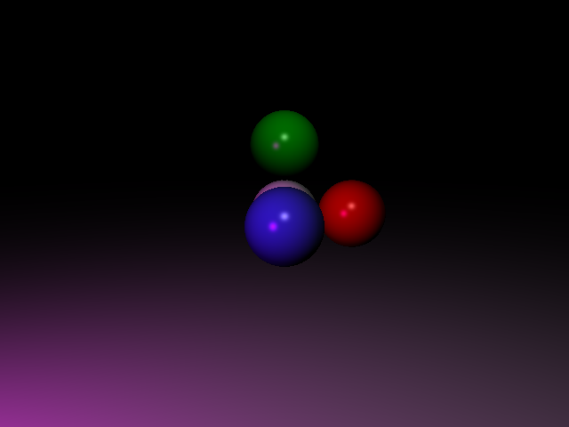
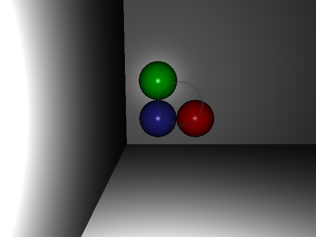
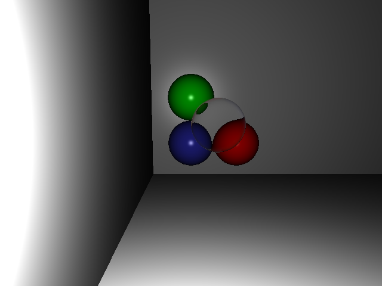
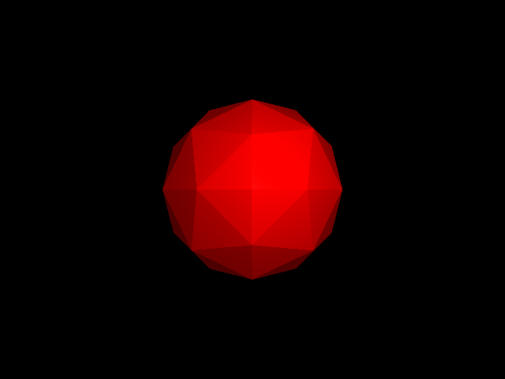
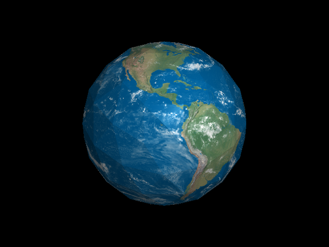

+++
template = "page.html"
title = "Ray Tracer"
+++

# Ray Tracer

## CS 130
I took UC Riverside's undergraduate Computer Graphics class (CS130) in the Fall
of 2025. This ray tracer was the first project we were assigned in that class.

In my opinion, CS130 is *the best* computer science class at the entire university. 
It's taught by [Craig Schroeder](https://www.cs.ucr.edu/~craigs/), who is an
excellent professor. His teaching assistant is also extremely good.

## The Project
The professor gave us a project template that included all the code necessary to
get started quickly. All the boilerplate for input parsing and vector arithmetic
was already implemented for us. Our assignment was to implement the actual ray
tracing math.

Due to the class's academic integrity policy, I cannot publish the code I wrote
for the project. I began reimplementing the project in a different language (Rust)
to get around this restriction. The professor gave me permission to publish my Rust
code, but I have not done so yet.

Instead of sharing the code, I'll just show and explain some of the scenes that
it can render.

We started the project by implementing the algorithm for casting rays from the 
camera, as well as the algorithm for ray-sphere intersections. That let us render
flat scenes like this:

Then we implemented the [Phong shader](https://en.wikipedia.org/wiki/Phong_shading)
for basic diffuse and specular lighting. This was the most difficult stage of the
project for me. Not because the math is hard, but because I hadn't yet developed
the intuition for debugging vector math. Also because I didn't realize that the
Blinn-Phong model is not equivalent to the Phong model (I spent at least an hour
scratching my head trying to figure out why my specular reflections were
ever-so-slightly wrong):

The whole point of a ray tracer is to be able to accurately render reflections
and refractions, so that was the next stage of the project:

Handling different indexes of refraction is trivial:

Finally, we extended the program beyond rendering spheres and into the realm of
meshes:

We also implemented UV texture mapping. By this point in the project, I had
learned the importance of working out all the math on paper *before* ever touching
the code. That made the process of implementing meshes and UV mapping very
straightforward. (I nearly got my implementation right on the first try!):
